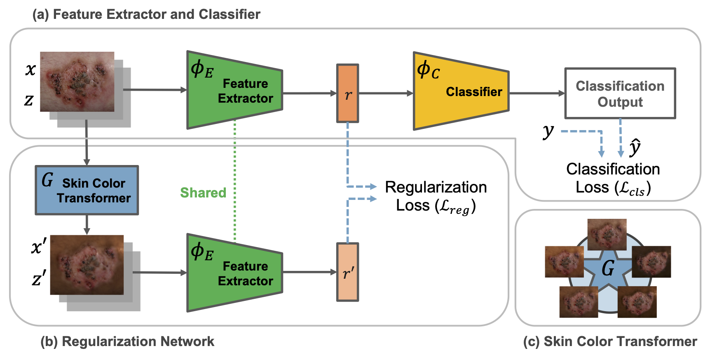

# CIRCLe: Color Invariant Representation Learning for Unbiased Classification of Skin Lesions


<p align="center">
Overview of CIRCLe.
      (a) The skin lesion image x with skin type z and diagnosis label y is passed through the feature extractor. The learned representation r goes through the classifier to obtain the predicted label.
      The classification loss enforces the correct classification objective.
      (b) The skin color transformer (G), transforms x with skin type z into x' with the new skin type z'. The generated image x' is fed into the feature extractor to get the representation r'. 
      The regularization loss enforces r and r' to be similar.
      (c) The skin color transformer's schematic view with the possible transformed images, where one of the possible transformations is randomly chosen for generating x'.
</p>

# Abstract
While deep learning based approaches have demonstrated expert-level performance in dermatological diagnosis tasks, they have also been shown to exhibit biases toward certain demographic attributes, particularly skin types (e.g., light versus dark), a fairness concern that must be addressed. We propose `CIRCLe`, a skin color invariant deep representation learning method for improving fairness in skin lesion classification. CIRCLe is trained to classify images by utilizing a regularization loss that encourages images with the same diagnosis but different skin types to have similar latent representations.

## Keywords
Fair AI, Skin Type Bias, Dermatology, Classification, Representation Learning.

# Cite
If you use our code, please cite our paper: 
[CIRCLe: Color Invariant Representation Learning for Unbiased Classification of Skin Lesions](https://www2.cs.sfu.ca/~hamarneh/ecopy/eccv_isic2022a.pdf)

The corresponding bibtex entry is:

```
@inproceedings{pakzad2022circle,
    title = {{CIRCLe}: Color Invariant Representation Learning for Unbiased Classification of Skin Lesions},
    author = {Pakzad, Arezou and Abhishek, Kumar and Harmaneh, Ghassan},
    booktitle = {Proceedings of the 17t hEuropean Conference on Computer Vision (ECCV) - ISIC Skin Image Analysis Workshop},
    year = {2022},
}
```

<!-- # Code
Code for StarGan is modified from https://github.com/yunjey/stargan -->

# Data
The `Fitzpatrick17K` dataset is available [here](https://github.com/mattgroh/fitzpatrick17k).

# Training
1) Train StarGAN:
```sh
python train_stargan.py --model_save_dir ./gan-path
```

2) Train `CIRCLe` (with or without the regularization loss):
```sh
python main.py --gan_path ./gan-path --use_reg_loss True 
#or
python main.py --gan_path ./gan-path --use_reg_loss False
```

- Train `CIRCLe` with different backbones:
```sh
python main.py --base vgg16 
python main.py --base densenet121
python main.py --base resnet18
python main.py --base resnet50
python main.py --base mobilenetv3l
python main.py --base mobilenetv2
```

